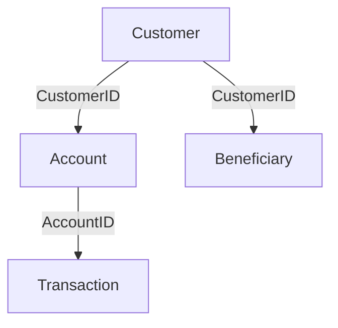

# What is SQL?

SQL (**Structured Query Language**) is a programming language used to interact with databases. It is the standard language for querying inserting, updating, and managing data stored in relational databases.

# Why we use SQL?

- Simplifies working with large dataset
- Enables easy and efficient data management
- SQL is universal and work with most database systems (lik PostgreSQL, MySQL, SQL Server)

# SQL used in following job roles of data field?

- Data Analyst
- Data Scientist
- Data Engineer
- SQL Developer
- Business Analyst
- Quality Analyst

# What is DATA?

- Anything & Everything can be considered as data
- Any information or fact can be considered as data
- For any Financial institute, details related to its employees, customer, their Services or even their address can be data.
- Data can be any form such as a text message or an image or a video or a document or single character itself.

# What is Database?

- A Database is a **collection of data** that can be easily access (digitally)
- A software to manage database is called **DBMS** (Database Management Software)

# 🏦 Bank Database Schema (Graph View)

This is a graph-based representation of a simple bank database schema.

---

## 🔗 Entity Relationship Graph



classDiagram
  class Customer {
    +int CustomerID
    +varchar Name
    +varchar Address
    +varchar Contact
    +varchar Username
    +varchar Password
  }

  class Account {
    +int AccountID
    +int CustomerID
    +varchar Type
    +decimal Balance
  }

  class Transaction {
    +int TransactionID
    +int AccountID
    +enum Type
    +decimal Amount
    +timestamp Timestamp
  }

  class Beneficiary {
    +int BeneficiaryID
    +int CustomerID
    +varchar Name
    +varchar AccountNumber
    +varchar BankDetails
  }

  Customer --> Account
  Account --> Transaction
  Customer --> Beneficiary
```
